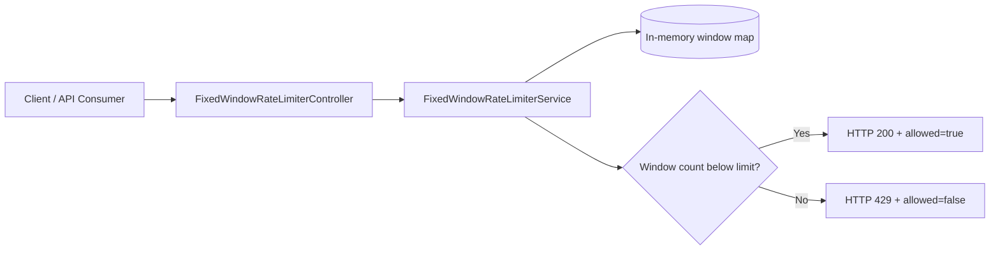
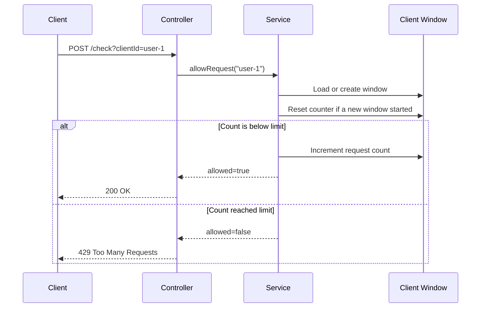

# Fixed Window Rate Limiter

## Idea

The fixed window algorithm counts requests in fixed time windows.

- Each client has a request counter for the current window.
- Every accepted request increments the counter by `1`.
- When the next fixed window starts, the counter resets to `0`.
- If the counter reaches the configured limit, new requests are rejected until the next window.
- This is simple and fast, but it can allow bursts around window boundaries.

## Current Configuration

The defaults live in `src/main/resources/application.properties`.

```properties
rate-limiter.fixed-window.max-requests=10
rate-limiter.fixed-window.window-size-seconds=60
```

This means:

- A client can send up to `10` accepted requests per `60` second window.
- The counter resets when the next fixed window starts.
- If a client sends more than `10` requests in the same window, extra requests receive HTTP `429 Too Many Requests`.

## API

Check whether a request is allowed:

```bash
curl -X POST "http://localhost:8080/api/v1/rate-limit/fixed-window/check?clientId=user-1"
```

Response when allowed:

```json
{
  "clientId": "user-1",
  "allowed": true,
  "requestCount": 1,
  "maxRequests": 10,
  "windowSizeSeconds": 60,
  "windowStartMillis": 1767225600000,
  "message": "Request accepted by fixed window limiter"
}
```

Reset one client window:

```bash
curl -X DELETE "http://localhost:8080/api/v1/rate-limit/fixed-window/clients?clientId=user-1"
```

Read active configuration:

```bash
curl "http://localhost:8080/api/v1/rate-limit/fixed-window/configuration"
```

## Batch Testing

Send 15 requests for the same client in quick succession:

```powershell
1..15 | % {
    curl.exe -X POST "http://localhost:8080/api/v1/rate-limit/fixed-window/check?clientId=12345"
}
```

With the default limit of `10` requests per `60` second window, the first 10 requests are accepted and the remaining requests are rejected until the next window starts.

Example result:

```json
{"clientId":"12345","allowed":true,"requestCount":1,"maxRequests":10,"windowSizeSeconds":60,"windowStartMillis":1767225600000,"message":"Request accepted by fixed window limiter"}
{"clientId":"12345","allowed":true,"requestCount":2,"maxRequests":10,"windowSizeSeconds":60,"windowStartMillis":1767225600000,"message":"Request accepted by fixed window limiter"}
{"clientId":"12345","allowed":true,"requestCount":3,"maxRequests":10,"windowSizeSeconds":60,"windowStartMillis":1767225600000,"message":"Request accepted by fixed window limiter"}
{"clientId":"12345","allowed":true,"requestCount":4,"maxRequests":10,"windowSizeSeconds":60,"windowStartMillis":1767225600000,"message":"Request accepted by fixed window limiter"}
{"clientId":"12345","allowed":true,"requestCount":5,"maxRequests":10,"windowSizeSeconds":60,"windowStartMillis":1767225600000,"message":"Request accepted by fixed window limiter"}
{"clientId":"12345","allowed":true,"requestCount":6,"maxRequests":10,"windowSizeSeconds":60,"windowStartMillis":1767225600000,"message":"Request accepted by fixed window limiter"}
{"clientId":"12345","allowed":true,"requestCount":7,"maxRequests":10,"windowSizeSeconds":60,"windowStartMillis":1767225600000,"message":"Request accepted by fixed window limiter"}
{"clientId":"12345","allowed":true,"requestCount":8,"maxRequests":10,"windowSizeSeconds":60,"windowStartMillis":1767225600000,"message":"Request accepted by fixed window limiter"}
{"clientId":"12345","allowed":true,"requestCount":9,"maxRequests":10,"windowSizeSeconds":60,"windowStartMillis":1767225600000,"message":"Request accepted by fixed window limiter"}
{"clientId":"12345","allowed":true,"requestCount":10,"maxRequests":10,"windowSizeSeconds":60,"windowStartMillis":1767225600000,"message":"Request accepted by fixed window limiter"}
{"clientId":"12345","allowed":false,"requestCount":10,"maxRequests":10,"windowSizeSeconds":60,"windowStartMillis":1767225600000,"message":"Request rejected because the fixed window limit is reached"}
```

The `windowStartMillis` value is aligned to the configured window size. With a `60` second window, all requests in the same minute share the same window start timestamp.

## Architecture



## Request Flow



## Complexity

| Operation | Complexity |
| --- | --- |
| Check request | `O(1)` |
| Reset client | `O(1)` |
| Memory | `O(number of active clients)` |

## Production Considerations

This implementation is intentionally in-memory because it is the best first step for learning the algorithm.

For a production distributed system:

- Store window counters in Redis so all app instances share the same limiter.
- Use atomic increment and expiry operations, usually Redis `INCR` with `EXPIRE` or a Lua script.
- Add TTLs for inactive client windows to prevent memory growth.
- Be aware of boundary bursts: a client can send requests at the end of one window and again at the start of the next.
- Add metrics for allowed requests, rejected requests, active windows, and Redis latency.
