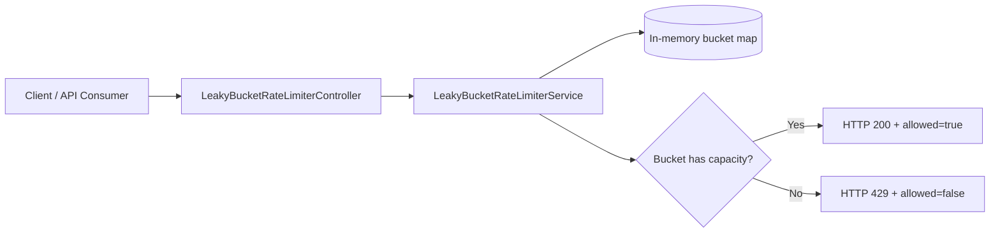
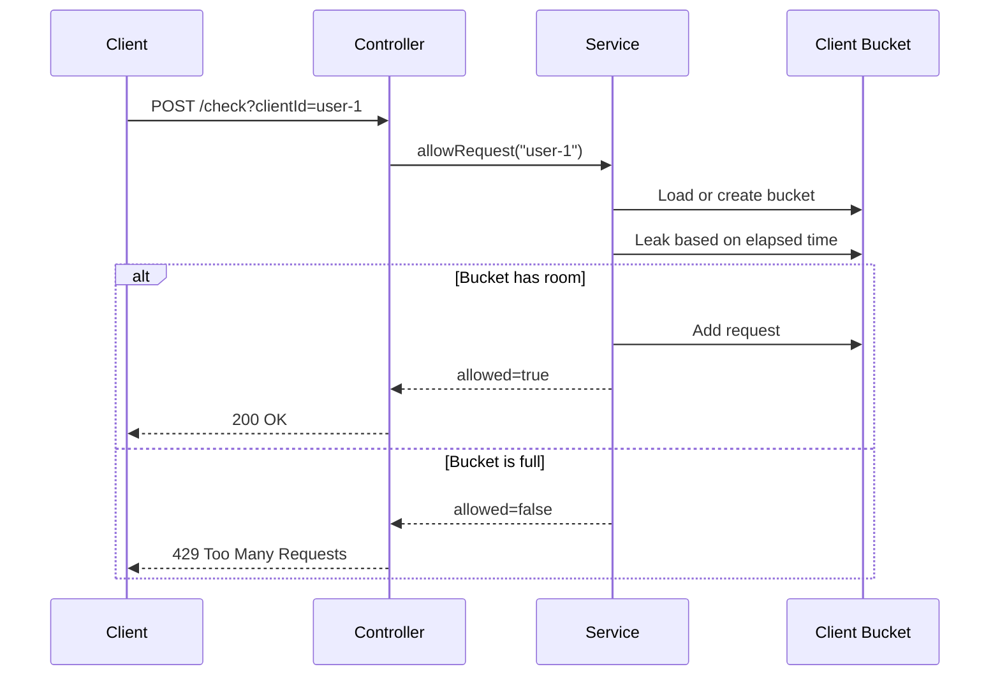

# Leaky Bucket Rate Limiter

## Idea

The leaky bucket algorithm treats incoming requests like water poured into a bucket.

- Every accepted request increases the bucket water level by `1`.
- The bucket leaks at a constant rate, for example `1 request per second`.
- If the bucket is full, new requests are rejected.
- Because leakage is steady, outgoing traffic becomes smoother than incoming traffic.

## Current Configuration

The defaults live in `src/main/resources/application.properties`.

```properties
rate-limiter.leaky-bucket.capacity=10
rate-limiter.leaky-bucket.leak-rate-per-second=1
```

This means:

- A client can build up at most `10` queued requests.
- The bucket drains at `1` request per second.
- If a client sends more requests than the bucket can absorb, extra requests receive HTTP `429 Too Many Requests`.

## API

Check whether a request is allowed:

```bash
curl -X POST "http://localhost:8080/api/v1/rate-limit/leaky-bucket/check?clientId=user-1"
```

Response when allowed:

```json
{
  "clientId": "user-1",
  "allowed": true,
  "currentWaterLevel": 1.0,
  "capacity": 10,
  "leakRatePerSecond": 1.0,
  "message": "Request accepted by leaky bucket limiter"
}
```

## Batch Testing

Send 15 requests for the same client in quick succession:

```powershell
1..15 | % {
    curl.exe -X POST "http://localhost:8080/api/v1/rate-limit/leaky-bucket/check?clientId=12345"
}
```

With the default capacity of `10` and leak rate of `1 request per second`, the first 10 requests are accepted and the remaining requests are rejected because the bucket is full.

Observed result:

```json
{"clientId":"12345","allowed":true,"currentWaterLevel":1.0,"capacity":10,"leakRatePerSecond":1.0,"message":"Request accepted by leaky bucket limiter"}
{"clientId":"12345","allowed":true,"currentWaterLevel":1.815,"capacity":10,"leakRatePerSecond":1.0,"message":"Request accepted by leaky bucket limiter"}
{"clientId":"12345","allowed":true,"currentWaterLevel":2.779,"capacity":10,"leakRatePerSecond":1.0,"message":"Request accepted by leaky bucket limiter"}
{"clientId":"12345","allowed":true,"currentWaterLevel":3.735,"capacity":10,"leakRatePerSecond":1.0,"message":"Request accepted by leaky bucket limiter"}
{"clientId":"12345","allowed":true,"currentWaterLevel":4.721,"capacity":10,"leakRatePerSecond":1.0,"message":"Request accepted by leaky bucket limiter"}
{"clientId":"12345","allowed":true,"currentWaterLevel":5.689,"capacity":10,"leakRatePerSecond":1.0,"message":"Request accepted by leaky bucket limiter"}
{"clientId":"12345","allowed":true,"currentWaterLevel":6.663,"capacity":10,"leakRatePerSecond":1.0,"message":"Request accepted by leaky bucket limiter"}
{"clientId":"12345","allowed":true,"currentWaterLevel":7.647,"capacity":10,"leakRatePerSecond":1.0,"message":"Request accepted by leaky bucket limiter"}
{"clientId":"12345","allowed":true,"currentWaterLevel":8.611,"capacity":10,"leakRatePerSecond":1.0,"message":"Request accepted by leaky bucket limiter"}
{"clientId":"12345","allowed":true,"currentWaterLevel":9.596,"capacity":10,"leakRatePerSecond":1.0,"message":"Request accepted by leaky bucket limiter"}
{"clientId":"12345","allowed":false,"currentWaterLevel":9.568,"capacity":10,"leakRatePerSecond":1.0,"message":"Request rejected because the bucket is full"}
{"clientId":"12345","allowed":false,"currentWaterLevel":9.551,"capacity":10,"leakRatePerSecond":1.0,"message":"Request rejected because the bucket is full"}
{"clientId":"12345","allowed":false,"currentWaterLevel":9.536,"capacity":10,"leakRatePerSecond":1.0,"message":"Request rejected because the bucket is full"}
{"clientId":"12345","allowed":false,"currentWaterLevel":9.504,"capacity":10,"leakRatePerSecond":1.0,"message":"Request rejected because the bucket is full"}
{"clientId":"12345","allowed":false,"currentWaterLevel":9.488,"capacity":10,"leakRatePerSecond":1.0,"message":"Request rejected because the bucket is full"}
```

The `currentWaterLevel` is not always an exact integer because the bucket leaks continuously between requests based on elapsed time.

Reset one client bucket:

```bash
curl -X DELETE "http://localhost:8080/api/v1/rate-limit/leaky-bucket/clients?clientId=user-1"
```

Read active configuration:

```bash
curl "http://localhost:8080/api/v1/rate-limit/leaky-bucket/configuration"
```

## Architecture



## Request Flow



## Complexity

| Operation | Complexity |
| --- | --- |
| Check request | `O(1)` |
| Reset client | `O(1)` |
| Memory | `O(number of active clients)` |

## Production Considerations

This implementation is intentionally in-memory because it is the best first step for learning the algorithm.

For a production distributed system:

- Store bucket state in Redis so all app instances share the same limiter.
- Use atomic updates, usually Redis Lua scripts, to avoid race conditions.
- Add TTLs for inactive client buckets to prevent memory growth.
- Decide fail-open vs fail-closed behavior when Redis is unavailable.
- Add metrics for allowed requests, rejected requests, active buckets, and Redis latency.

## Interview Notes

Leaky bucket is good when you want a stable output rate. Token bucket is usually preferred when controlled bursts are acceptable, because users can spend accumulated tokens quickly and then slow down.
