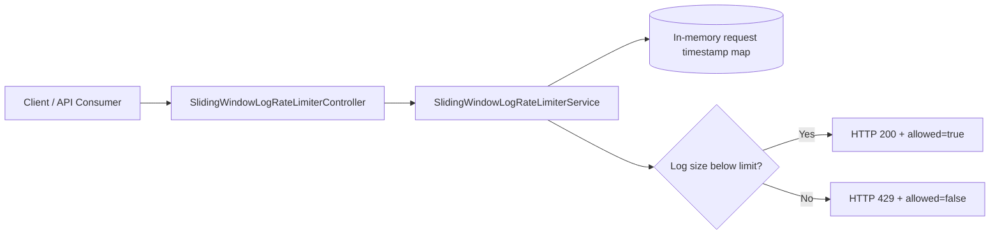
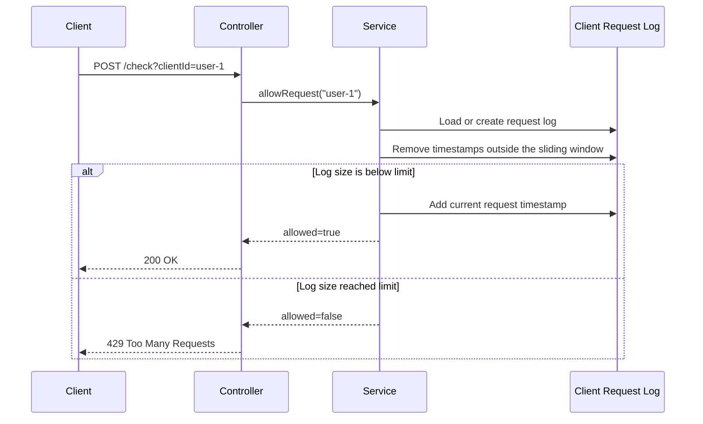

# Sliding Window Log Rate Limiter

## Idea

The sliding window log algorithm stores timestamps for accepted requests.

- Each client has a log of accepted request timestamps.
- Before each decision, timestamps older than the configured window are removed.
- If the remaining log size is below the configured limit, the request is accepted and the current timestamp is stored.
- If the log already has the configured number of requests, the request is rejected.
- This is more accurate than fixed window because the window moves with the current request time.

## Current Configuration

The defaults live in `src/main/resources/application.properties`.

```properties
rate-limiter.sliding-window-log.max-requests=10
rate-limiter.sliding-window-log.window-size-seconds=60
```

This means:

- A client can send up to `10` accepted requests in any rolling `60` second period.
- Requests older than `60` seconds are removed before each new decision.
- If a client sends more than `10` requests inside the rolling window, extra requests receive HTTP `429 Too Many Requests`.

## API

Check whether a request is allowed:

```bash
curl -X POST "http://localhost:8080/api/v1/rate-limit/sliding-window-log/check?clientId=user-1"
```

Response when allowed:

```json
{
  "clientId": "user-1",
  "allowed": true,
  "requestCount": 1,
  "maxRequests": 10,
  "windowSizeSeconds": 60,
  "oldestRequestMillis": 1767225600000,
  "message": "Request accepted by sliding window log limiter"
}
```

Reset one client log:

```bash
curl -X DELETE "http://localhost:8080/api/v1/rate-limit/sliding-window-log/clients?clientId=user-1"
```

Read active configuration:

```bash
curl "http://localhost:8080/api/v1/rate-limit/sliding-window-log/configuration"
```

## Batch Testing

Send 15 requests for the same client in quick succession:

```powershell
1..15 | % {
    curl.exe -X POST "http://localhost:8080/api/v1/rate-limit/sliding-window-log/check?clientId=12345"
}
```

With the default limit of `10` requests per rolling `60` second window, the first 10 requests are accepted and the remaining requests are rejected until older accepted request timestamps expire.

Example result:

```json
{"clientId":"12345","allowed":true,"requestCount":1,"maxRequests":10,"windowSizeSeconds":60,"oldestRequestMillis":1782789122433,"message":"Request accepted by sliding window log limiter"}
{"clientId":"12345","allowed":true,"requestCount":2,"maxRequests":10,"windowSizeSeconds":60,"oldestRequestMillis":1782789122433,"message":"Request accepted by sliding window log limiter"}
{"clientId":"12345","allowed":true,"requestCount":3,"maxRequests":10,"windowSizeSeconds":60,"oldestRequestMillis":1782789122433,"message":"Request accepted by sliding window log limiter"}
{"clientId":"12345","allowed":true,"requestCount":4,"maxRequests":10,"windowSizeSeconds":60,"oldestRequestMillis":1782789122433,"message":"Request accepted by sliding window log limiter"}
{"clientId":"12345","allowed":true,"requestCount":5,"maxRequests":10,"windowSizeSeconds":60,"oldestRequestMillis":1782789122433,"message":"Request accepted by sliding window log limiter"}
{"clientId":"12345","allowed":true,"requestCount":6,"maxRequests":10,"windowSizeSeconds":60,"oldestRequestMillis":1782789122433,"message":"Request accepted by sliding window log limiter"}
{"clientId":"12345","allowed":true,"requestCount":7,"maxRequests":10,"windowSizeSeconds":60,"oldestRequestMillis":1782789122433,"message":"Request accepted by sliding window log limiter"}
{"clientId":"12345","allowed":true,"requestCount":8,"maxRequests":10,"windowSizeSeconds":60,"oldestRequestMillis":1782789122433,"message":"Request accepted by sliding window log limiter"}
{"clientId":"12345","allowed":true,"requestCount":9,"maxRequests":10,"windowSizeSeconds":60,"oldestRequestMillis":1782789122433,"message":"Request accepted by sliding window log limiter"}
{"clientId":"12345","allowed":true,"requestCount":10,"maxRequests":10,"windowSizeSeconds":60,"oldestRequestMillis":1782789122433,"message":"Request accepted by sliding window log limiter"}
{"clientId":"12345","allowed":false,"requestCount":10,"maxRequests":10,"windowSizeSeconds":60,"oldestRequestMillis":1782789122433,"message":"Request rejected because the sliding window log limit is reached"}
{"clientId":"12345","allowed":false,"requestCount":10,"maxRequests":10,"windowSizeSeconds":60,"oldestRequestMillis":1782789122433,"message":"Request rejected because the sliding window log limit is reached"}
{"clientId":"12345","allowed":false,"requestCount":10,"maxRequests":10,"windowSizeSeconds":60,"oldestRequestMillis":1782789122433,"message":"Request rejected because the sliding window log limit is reached"}
{"clientId":"12345","allowed":false,"requestCount":10,"maxRequests":10,"windowSizeSeconds":60,"oldestRequestMillis":1782789122433,"message":"Request rejected because the sliding window log limit is reached"}
{"clientId":"12345","allowed":false,"requestCount":10,"maxRequests":10,"windowSizeSeconds":60,"oldestRequestMillis":1782789122433,"message":"Request rejected because the sliding window log limit is reached"}
```

## Architecture



## Request Flow



## Complexity

| Operation | Complexity |
| --- | --- |
| Check request | `O(k)` where `k` is the number of expired timestamps removed |
| Reset client | `O(1)` |
| Memory | `O(number of active clients * maxRequests)` |

## Production Considerations

This implementation is intentionally in-memory because it is the best first step for learning the algorithm.

For a production distributed system:

- Store request timestamps in Redis using sorted sets.
- Use an atomic Lua script to remove expired timestamps, count the active window, and add the new request.
- Add TTLs for inactive client logs to prevent memory growth.
- Include a unique request identifier with each timestamp if multiple requests can arrive in the same millisecond.
- Add metrics for allowed requests, rejected requests, active client logs, and Redis latency.
