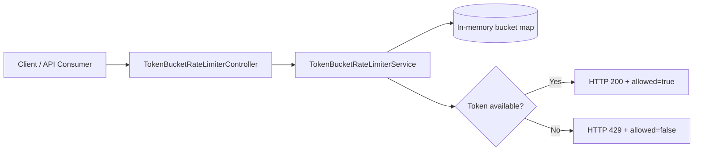
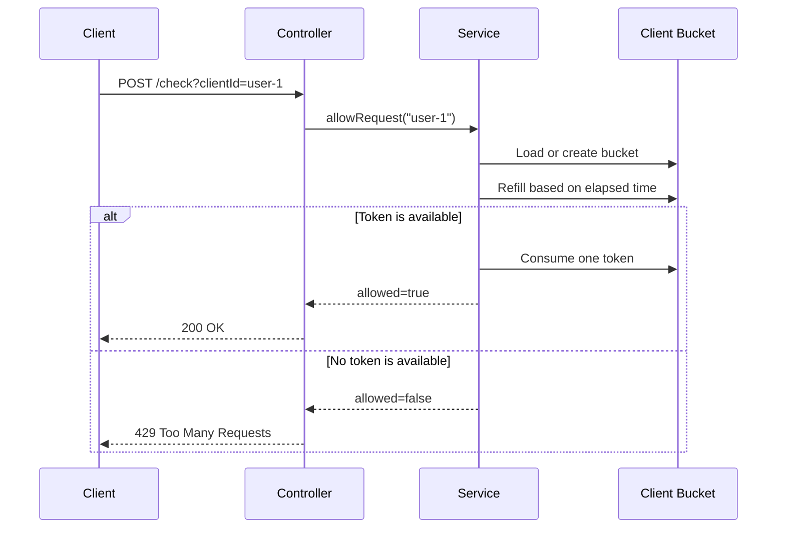

# Token Bucket Rate Limiter

## Idea

The token bucket algorithm stores permission tokens in a bucket.

- The bucket starts full for each client.
- Every accepted request consumes `1` token.
- Tokens are refilled at a constant rate, for example `1 token per second`.
- If no token is available, new requests are rejected.
- Because tokens can accumulate up to capacity, clients can send controlled bursts.

## Current Configuration

The defaults live in `src/main/resources/application.properties`.

```properties
rate-limiter.token-bucket.capacity=10
rate-limiter.token-bucket.refill-rate-per-second=1
```

This means:

- A client can spend up to `10` tokens in a burst.
- The bucket refills at `1` token per second.
- If a client sends requests after all tokens are consumed, extra requests receive HTTP `429 Too Many Requests`.

## API

Check whether a request is allowed:

```bash
curl -X POST "http://localhost:8080/api/v1/rate-limit/token-bucket/check?clientId=user-1"
```

Response when allowed:

```json
{
  "clientId": "user-1",
  "allowed": true,
  "currentTokens": 9.0,
  "capacity": 10,
  "refillRatePerSecond": 1.0,
  "message": "Request accepted by token bucket limiter"
}
```

Reset one client bucket:

```bash
curl -X DELETE "http://localhost:8080/api/v1/rate-limit/token-bucket/clients?clientId=user-1"
```

Read active configuration:

```bash
curl "http://localhost:8080/api/v1/rate-limit/token-bucket/configuration"
```

## Batch Testing

Send 15 requests for the same client in quick succession:

```powershell
1..15 | % {
    curl.exe -X POST "http://localhost:8080/api/v1/rate-limit/token-bucket/check?clientId=12345"
}
```

With the default capacity of `10` and refill rate of `1 token per second`, the first 10 requests are usually accepted and the remaining requests are rejected until tokens refill.

Observed result:

```json
{"clientId":"12345","allowed":true,"currentTokens":9.0,"capacity":10,"refillRatePerSecond":1.0,"message":"Request accepted by token bucket limiter"}
{"clientId":"12345","allowed":true,"currentTokens":8.05,"capacity":10,"refillRatePerSecond":1.0,"message":"Request accepted by token bucket limiter"}
{"clientId":"12345","allowed":true,"currentTokens":7.079000000000001,"capacity":10,"refillRatePerSecond":1.0,"message":"Request accepted by token bucket limiter"}
{"clientId":"12345","allowed":true,"currentTokens":6.111000000000001,"capacity":10,"refillRatePerSecond":1.0,"message":"Request accepted by token bucket limiter"}
{"clientId":"12345","allowed":true,"currentTokens":5.1290000000000004,"capacity":10,"refillRatePerSecond":1.0,"message":"Request accepted by token bucket limiter"}
{"clientId":"12345","allowed":true,"currentTokens":4.158,"capacity":10,"refillRatePerSecond":1.0,"message":"Request accepted by token bucket limiter"}
{"clientId":"12345","allowed":true,"currentTokens":3.1830000000000007,"capacity":10,"refillRatePerSecond":1.0,"message":"Request accepted by token bucket limiter"}
{"clientId":"12345","allowed":true,"currentTokens":2.2070000000000007,"capacity":10,"refillRatePerSecond":1.0,"message":"Request accepted by token bucket limiter"}
{"clientId":"12345","allowed":true,"currentTokens":1.2300000000000009,"capacity":10,"refillRatePerSecond":1.0,"message":"Request accepted by token bucket limiter"}
{"clientId":"12345","allowed":true,"currentTokens":0.2540000000000009,"capacity":10,"refillRatePerSecond":1.0,"message":"Request accepted by token bucket limiter"}
{"clientId":"12345","allowed":false,"currentTokens":0.2820000000000009,"capacity":10,"refillRatePerSecond":1.0,"message":"Request rejected because no token is available"}
{"clientId":"12345","allowed":false,"currentTokens":0.30600000000000094,"capacity":10,"refillRatePerSecond":1.0,"message":"Request rejected because no token is available"}
{"clientId":"12345","allowed":false,"currentTokens":0.32600000000000096,"capacity":10,"refillRatePerSecond":1.0,"message":"Request rejected because no token is available"}
{"clientId":"12345","allowed":false,"currentTokens":0.356000000000001,"capacity":10,"refillRatePerSecond":1.0,"message":"Request rejected because no token is available"}
{"clientId":"12345","allowed":false,"currentTokens":0.382000000000001,"capacity":10,"refillRatePerSecond":1.0,"message":"Request rejected because no token is available"}
```

The `currentTokens` value is not always an exact integer because the bucket refills continuously between requests based on elapsed time. A rejected request can show a slightly higher token count than the previous request, but it is still rejected until at least `1` full token is available.

## Architecture



## Request Flow



## Complexity

| Operation | Complexity |
| --- | --- |
| Check request | `O(1)` |
| Reset client | `O(1)` |
| Memory | `O(number of active clients)` |

## Production Considerations

This implementation is intentionally in-memory because it is the best first step for learning the algorithm.

For a production distributed system:

- Store bucket state in Redis so all app instances share the same limiter.
- Use atomic updates, usually Redis Lua scripts, to avoid race conditions.
- Add TTLs for inactive client buckets to prevent memory growth.
- Decide fail-open vs fail-closed behavior when Redis is unavailable.
- Add metrics for allowed requests, rejected requests, active buckets, and Redis latency.
